# BUỔI 3: SQL CƠ BẢN
## I. Các thao tác cơ bản: SELECT, INSERT, UPDATE, DELETE, từ khóa AS, DISTINCT
###  1. Select
- Câu lệnh **SELECT** được sử dụng để truy vấn và lấy dữ liệu từ một hoặc nhiều bảng trong cơ sở dữ liệu. Đây là câu lệnh phổ biến nhất trong SQL.
- Cú pháp : 
    ```
    SELECT column1, column2....columnN
    FROM   table_name;
    WHERE condition;
    ```

- Ví dụ: Lấy tất cả các tên và tuổi từ bảng student có độ tuổi > 18:
    ``` 
    SELECT name, age FROM students WHERE age > 18; 
    ```
### 2. INSERT
- Câu lệnh INSERT được sử dụng để thêm dữ liệu vào bảng. 
- Cú pháp:
   ``` 	
   INSERT INTO table_name( column1, column2....columnN)
   VALUES ( value1, value2....valueN);
   ```
- Ví dụ:
    -  Thêm 1 dòng:
        ``` 
        INSERT INTO employees (name, department, salary, hire_date)
        VALUES ('Nguyễn Văn A', 'Kinh doanh', 15000000, '2024-03-01');
        ```

    -   Thêm nhiều dòng:
        ```
        INSERT INTO employees (name, department, salary)
        VALUES 
        ('Trần Thị B', 'Kế toán', 12000000),
        ('Lê Văn C', 'IT', 20000000),
        ('Phạm Thị D', 'Nhân sự', 13000000);
        ```
    
    -   INSERT FROM SELECT: Copy dữ liệu từ bảng này sang bảng khác
        ``` 
        INSERT INTO employees_backup (name, department, salary)
        SELECT name, department, salary
        FROM employees
        WHERE hire_date >= '2024-01-01';
        ```
### 3. UPDATE
- Câu lệnh **UPDATE** cho phép bạn cập nhật dữ liệu đã có trong bảng. Có thể thay đổi một hoặc nhiều giá trị trong một bảng.
- Cú pháp:
```
UPDATE table_name 
SET column1 = value1 
WHERE condition; 
```
- Ví dụ: Cập nhật tuổi của nhân viên với ID là 101:
```
UPDATE employees SET age = 31 WHERE employee_id = 101;
```
- Lưu ý: Luôn dùng **WHERE** khi **UPDATE**. Nếu quên **WHERE**, tất cả dòng sẽ bị cập nhật.

### 4. DELETE
- Câu lệnh **DELETE** dùng để xóa dữ liệu khỏi bảng. Có thể xóa một hoặc nhiều bản ghi dựa trên điều kiện cụ thể.
- Cú pháp: 
```
DELETE FROM table_name
WHERE  {CONDITION}
```
- Ví dụ: 
```
Xoá nhân viên cụ thể
DELETE FROM employees WHERE id = 10;

Xoá tất cả nhân viên đã nghỉ
DELETE FROM employees WHERE status = 'resigned';
```
- Lưu ý: **DELETE** không có **WHERE** sẽ xóa toàn bộ bảng.
### 5.Từ khóa AS:
- Là một công cụ mạnh mẽ để tạo bí danh (alias) cho các cột và bảng trong truy vấn. Sử dụng từ khóa AS giúp câu lệnh SQL trở nên ngắn gọn và dễ hiểu hơn. 
- Cú pháp: 
    - Bí danh cho cột: 
      ```
      SELECT column_name AS alias_name FROM table_name;
      ```
    - Bí danh cho bảng: 
      ```
      SELECT column1, column2 FROM table_name AS alias_name;
      ```
- Ví dụ về sử dụng bí danh cho cột:
    - Truy vấn:
      ```
      SELECT first_name AS "Tên", last_name AS "Họ" FROM employees;
      ```
    - Kết quả: Truy vấn này sẽ trả về hai cột với tên "Tên" và "Họ" thay vì "first_name" và "last_name".
- Ví dụ 2: Sử dụng AS để đổi tên bảng.
    - Truy vấn:
      ```
      SELECT e.employee_id, e.first_name FROM employees AS e;
      ```
    - Kết quả: Sử dụng bí danh e giúp truy vấn ngắn gọn hơn, đặc biệt hữu ích khi làm việc với nhiều bảng.
- Ví dụ 3: Kết hợp các bí danh trong truy vấn phức tạp.
    - Truy vấn:
    ``` 
    SELECT p.product_name AS "Tên Sản Phẩm", c.category_name AS "Loại Sản Phẩm" 
    FROM products AS p 
    JOIN categories AS c ON p.category_id = c.category_id;
    ```
    - Kết quả: Truy vấn kết hợp dữ liệu từ hai bảng khác nhau, đồng thời sử dụng bí danh để làm rõ tên cột trong kết quả trả về.
- Lợi ích của việc sử dụng bí danh:
    - Giúp câu lệnh SQL ngắn gọn và dễ đọc hơn
    - Tránh xung đột tên khi làm việc với nhiều bảng có cùng tên cột
    - Cải thiện khả năng bảo trì và hiểu biết về mã nguồn SQL
### 6. DISTINCT
- **DISTINCT** là một chỉ thị (modifier) đi sau **SELECT**, ra lệnh cho Database Engine loại bỏ tất cả các dòng trùng lặp trong tập kết quả và chỉ giữ lại duy nhất một dòng đại diện.
- Cú pháp:
```
SELECT DISTINCT cot1, cot2,... cotN 
FROM ten_bang
WHERE [dieu_kien]
```
- Ví dụ: Giả sử ta có bảng NHANVIEN có các bản ghi như sau:

| ID | TEN   | TUOI | DIACHI   | LUONG    |
|----|-------|------|----------|----------|
| 1  | Thanh | 32   | Haiphong | 2000.00  |
| 2  | Loan  | 25   | Hanoi    | 1500.00  |
| 3  | Nga   | 23   | Hanam    | 2000.00  |
| 4  | Manh  | 25   | Hue      | 6500.00  |
| 5  | Huy   | 27   | Hatinh   | 8500.00  |
| 6  | Cao   | 22   | HCM      | 4500.00  |
| 7  | Lam   | 24   | Hanoi    | 10000.00 |

Trước tiên, chúng ta hãy xem cách truy vấn SELECT trả về bản ghi mức lương trùng lặp như thế nào.
```
SELECT LUONG 
FROM NHANVIEN
ORDER BY LUONG;
```
Trong kết quả thu được sau đây, LUONG 2000 xuất hiện 2 lần là một bản ghi trùng lặp từ bảng ban đầu.

| LUONG    |
|----------|
| 1500.00  |
| 2000.00  |
| 2000.00  |
| 4500.00  |
| 6500.00  |
| 8500.00  |
| 10000.00 |

Bây giờ, hãy sử dụng từ khóa DISTINCT với truy vấn SELECT và xem kết quả.
```
SELECT DISTINCT LUONG 
FROM NHANVIEN
ORDER BY LUONG;
```

| LUONG    |
|----------|
| 1500.00  |
| 2000.00  |
| 4500.00  |
| 6500.00  |
| 8500.00  |
| 10000.00 |

Nhờ **DISTINCT** mà kết quả thu được không có bất kỳ mục nhập trùng lặp nào.
##### DISTINCT với hàm COUNT()
- Hàm COUNT() được dùng để lấy số bản ghi được tinh chỉnh lại bằng truy vấn SELECT. Bạn cần chuyển một biểu thức sang hàm này để truy vấn SELECT trả về số bản ghi thỏa mãn biểu thức đã chỉ định.
- Nếu chuyển từ khóa DISTINCT sang hàm COUNT() dưới dạng một biểu thức, nó trả về số giá trị riêng trong một cột của bảng.
- Cú pháp sử dụng DISTINCT với hàm COUNT():
```
SELECT COUNT(DISTINCT column_name)
FROM table_name WHERE condition;
```
Trong đó, **column_name** là tên cột mà bạn muốn đếm giá trị duy nhất. Table_name là tên bảng chứa dữ liệu.
- Ví dụ:
    - Trong truy vấn sau, chúng ta truy xuất số độ tuổi khác nhau của khách hàng:
    ```
    SELECT COUNT(DISTINCT AGE) as UniqueAge FROM CUSTOMERS;
    ```
    - Kết quả: UniqueAge = 6
  
## II. Lọc dữ liệu: WHERE, HAVING
### 1.WHERE
- Mệnh đề **WHERE** trong SQL được sử dụng trong các truy vấn nhằm lọc dữ liệu theo điều kiện nhất định. Nó chỉ lấy những dòng dữ liệu đáp ứng điều kiện trước khi thực hiện việc nhóm. Mệnh đề này có thể kết hợp với các toán tử logic như AND, OR, NOT, và hỗ trợ các toán tử so sánh.
- Cú pháp:
```
SELECT column_list
FROM table_name
WHERE condition
GROUP BY column_list;
```
- Trong đó: 
    - WHERE condition: lọc các dòng dữ liệu trước khi nhóm
    - GROUP BY column_list: Nhóm các dòng có cùng giá trị ở cột được chỉ định
    - Các cột trong SELECT phải có trong GROUP BY, ngoại trừ các cột được sử dụng hàm tổng hợp (COUNT(), SUM(), AVG(), MAX(), MIN(),..)
- Ví dụ ta có bảng Sales.Invoices  

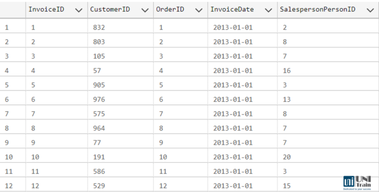
Muốn trích xuất đơn hàng trong tháng 3 năm 2013, ta thực hiện câu lệnh:
```
SELECT OrderID,
    InvoiceDate 
FROM Sales.Invoices  
WHERE MONTH(InvoiceDate) = 3 AND  
YEAR(InvoiceDate) = 2013
```
Kết quả hiển thị như sau: 
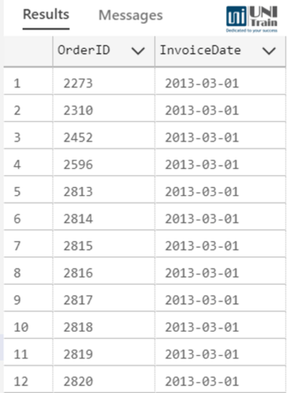
Ngoài ra nếu lọc nhiều giá trị ở một cột ta có thể sử dụng WHERE IN, ví dụ như chọn các quốc gia đến từ Châu Á (Asia), Châu Âu(Europe), Châu phi (Africa): 
```
SELECT CountryName, Region 
FROM Application.Countries
WHERE Region in ('Asia','Europe','Africa')
```

### 2.HAVING:
- Mệnh đề **HAVING** trong SQL được sử dụng kết hợp với **GROUP BY** để lọc các nhóm dữ liệu dựa trên kết quả của các hàm tổng. HAVING thực hiện việc lọc sau khi dữ liệu đã được tổng hợp
- Cú pháp mệnh đề HAVING:
```
SELECT column_list, 
aggregate_function(expression) 
FROM table_name 
WHERE condition 
GROUP BY column_list 
HAVING condition
```
Trong đó:
- **SELECT column_list, aggregate_function(expression)**: chọn cột và tính toán trên dữ liệu.
- **FROM table_name**: xác định bảng cần truy vấn
- **WHERE condition**: lọc dữ liệu trước khi nhóm
- **GROUP BY column_list**: lọc nhóm sau khi tổng hợp

Ví dụ đối với bảng Sales.Invoices như trên Tìm top 10 khách hàng có số ngày mua hàng <= 40 ngày:
```
SELECT Top 10 CustomerID,
COUNT(distinct InvoiceDate) as 'SNMH' 
FROM Sales.Invoices 
GROUP BY CustomerID 
HAVING COUNT(distinct InvoiceDate)<=40 
ORDER by COUNT(InvoiceID) desc
```
Kết quả hiển thị như sau: 
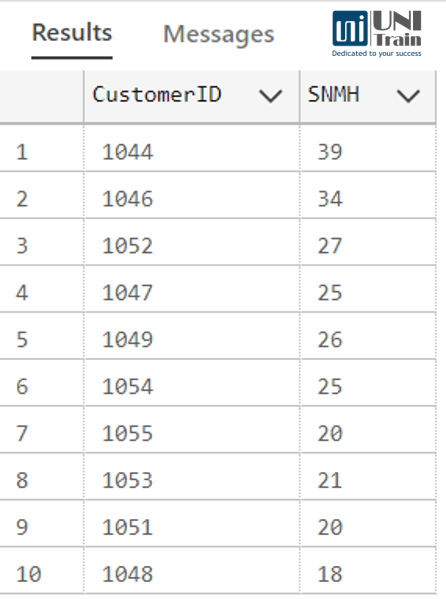
### 3.Sự khác biệt chính giữa WHERE và HAVING 

| **Tiêu chí**                 | **WHERE**                                      | **HAVING**                                 |
| ---------------------------- | ---------------------------------------------- | ------------------------------------------ |
| **Chức năng**                | Lọc từng dòng trước khi nhóm                   | Lọc nhóm sau khi tổng hợp                  |
| **Sử dụng với hàm tổng hợp** | Không thể dùng trực tiếp với hàm tổng hợp      | Có thể dùng với `SUM`, `COUNT`, `AVG`, ... |
| **Thứ tự thực thi**          | Trước `GROUP BY`                               | Sau `GROUP BY`                             |
| **Hiệu suất**                | Thường nhanh hơn vì lọc dữ liệu trước khi nhóm | Có thể chậm hơn vì lọc sau khi nhóm        |
| **Phạm vi sử dụng**          | `SELECT`, `UPDATE`, `DELETE`                   | Chủ yếu dùng với `SELECT`                  |

**Kết hợp WHERE và HAVING trong SQL**
- Chúng ta có thể sử dụng cả WHERE và HAVING trong cùng một truy vấn. Mệnh đề WHERE lọc dữ liệu thô và sau khi nhóm, mệnh đề HAVING sẽ lọc kết quả đã tổng hợp. 
- Ví dụ Tìm top 10 khách hàng có số ngày mua hàng <= 40 ngày trong năm 2015:
```
SELECT TOP 10 CustomerID,
    COUNT(distinct InvoiceDate) as 'SNMH' 
FROM Sales.Invoices 
WHERE YEAR(InvoiceDate)=2015 
GROUP BY CustomerID 
HAVING COUNT(distinct InvoiceDate)<=40 
ORDER by COUNT(InvoiceID) desc
```
Kết quả như sau:
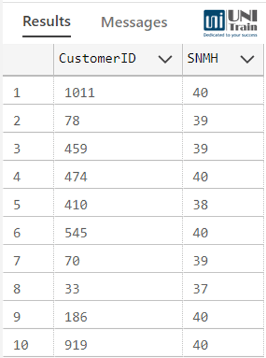
## III. Kết hợp bảng và kết quả: JOIN, UNION
### 1.JOIN
- **Join** là mệnh đề trong SQL, được dùng để kết nối dữ liệu từ hai hay nhiều bảng lại với nhau. JOIN cho phép truy vấn các cột dữ liệu từ nhiều bảng khác nhau để trả về trong cùng một tập kết quả. 
#### a.Các loại join:
- Inner Join Kết hợp điểm chung:
    - INNER JOIN trả về kết quả là các bản ghi mà trường được join ở hai bảng khớp nhau, các bản ghi chỉ xuất hiện ở một trong hai bảng sẽ bị loại.
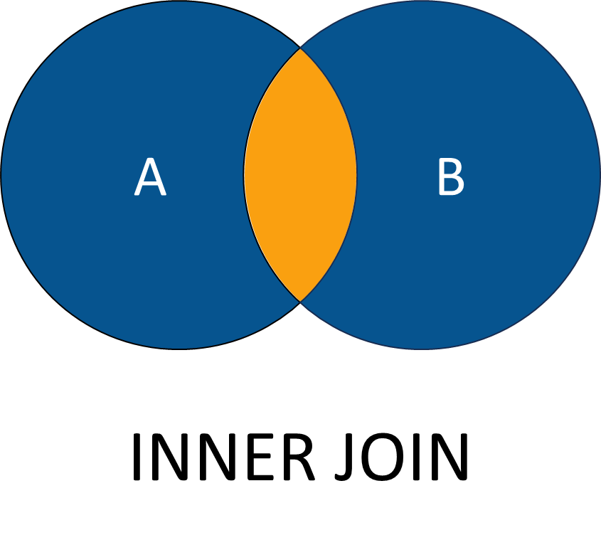
    - Cú pháp của INNER JOIN:
        ```
        SELECT
          A.Col_Name,
          B.Col_Name
        FROM Table_A
        INNER JOIN Table_B
        On A.Key = B.Key
        ```
    - Giải thích câu lệnh truy vấn:
        - **FROM**: Dữ liệu được lấy từ bảng SalesLT.Customer.
        - **SELECT ***: Truy vấn tất cả các hàng trong bảng dữ liệu.
    - Ví dụ: INNER JOIN bảng Customer và CustomerAddress để truy vấn dữ liệu từ cột AddressType.
    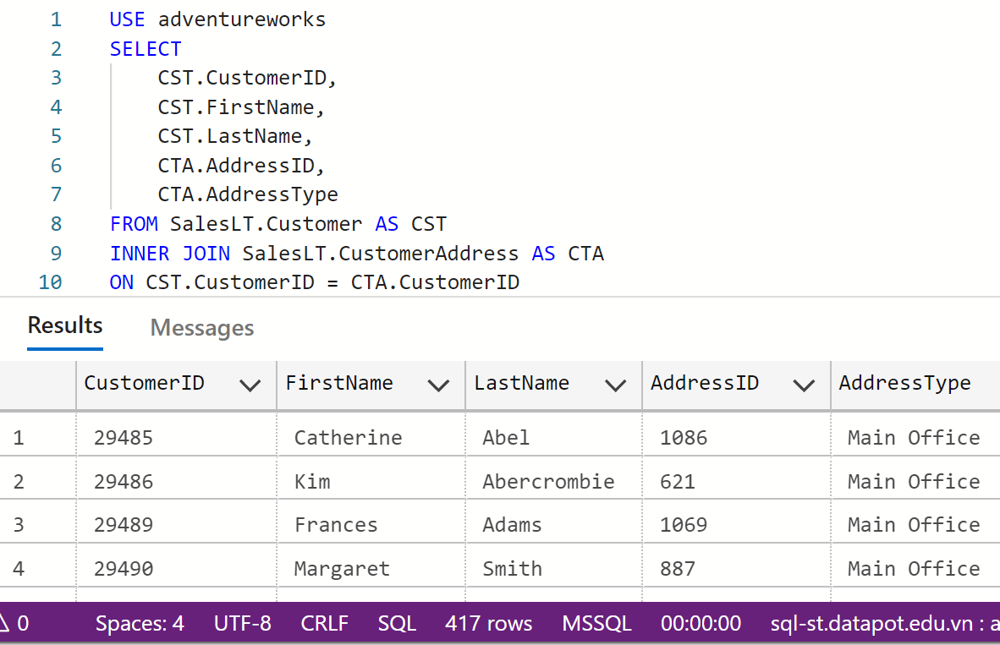
    - Giải thích câu lệnh truy vấn:
        - INNER JOIN: Kết hợp điểm chung bảng Customer được gán tên CST với bảng CustomerAddress được gán tên CTA.
        - ON: Khai báo điều kiện kết hợp bảng từ cột khoá chính CustomerID trong bảng Customer và khoá ngoại CustomerID trong bảng CustomerAddress.
- Kết hợp trái(Left Join)
    - Nếu bảng A LEFT JOIN với bảng B thì kết quả gồm các bản ghi có trong bảng A, với các bản ghi không có mặt trong bảng B thì các cột từ B được điền NULL. Các bản ghi chỉ có trong B mà không có trong A sẽ không được trả về.
    - Bảng được xác định là left trong phép JOIN là bảng được viết trước.
    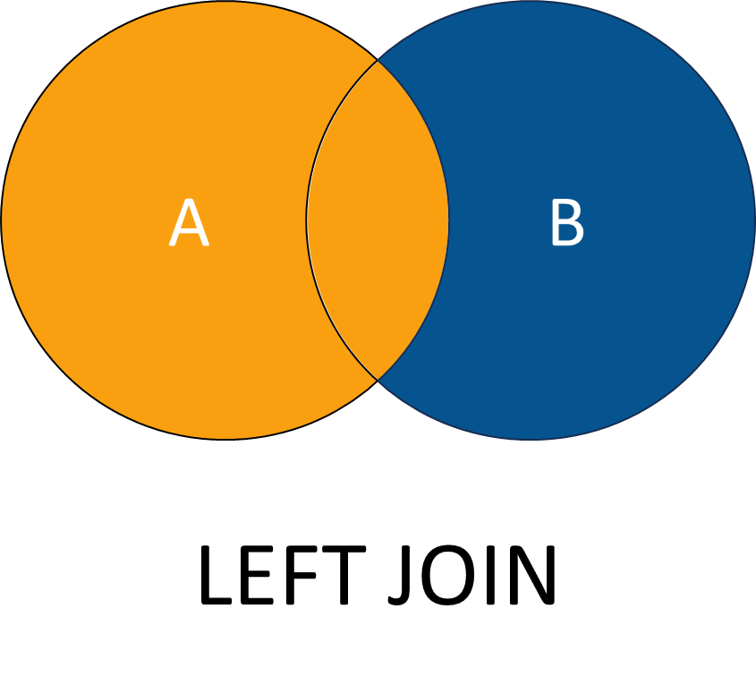
    - Cú pháp của LEFT JOIN:
  
    ```
        SELECT
            A.Col_Name,
            B.Col_Name
        FROM Table_A
        LEFT JOIN Table_B
        ON A.Key = B.Key
    ```
    - Ví dụ: Chọn bảng dữ liệu adventureworks, kết hợp trái giữa bảng Customer và Customer Address
    - Giải thích câu lệnh truy vấn:
        - LEFT JOIN: Kết hợp trái bảng Customer được gán tên CST với bảng CustomerAddress được gán tên CTA.
        - ON: Khai báo điều kiện kết hợp bảng từ cột khoá chính CustomerID trong bảng Customer và khoá ngoại CustomerID trong bảng CustomerAddress.
- Kết hợp phải (Right join)
    - Nếu bảng được kết hợp phải với bảng B thì kết quả gồm các bản ghi có trong bảng B. Với các bản ghi không có mặt trong bảng A thì các cột từ bảng A được trả về NULL. Các bản ghi chỉ có trong bảng A mà không có trong bảng B sẽ không được trả về.
    - Cú pháp của RIGHT JOIN:
    ```
    SELECT
        A.Col_Name,
        B.Col_Name
     FROM Table_A
     RIGHT JOIN Table_B
     On A.Key = B.Key
    ```
    - Ví dụ: Chọn bảng dữ liệu adventureworks, kết hợp phải giữa bảng Customer và Customer Address.
    - Giải thích câu lệnh truy vấn:
        - RIGHT JOIN: Kết hợp phải bảng Customer được gán tên CST với bảng CustomerAddress được gán tên CTA.
        - ON: Khai báo điều kiện kết hợp bảng từ cột khoá chính CustomerID trong bảng Customer và khoá ngoại CustomeID trong bảng bảng CustomerAddress.
- Kết hợp chéo (Cross join)
    - Kết hợp chéo (Cross join) là kết hợp giữa các hàng của hai bảng với nhau, mỗi hàng trong bảng thứ nhất sẽ kết hợp với N hàng của bảng thứ hai. Kết quả của kết hợp chéo (Cross join) sẽ có số hàng bằng tích số của hai bảng.
    - Do kết quả trả ra của Cross join có thể rất lớn là tích số của hai bảng, cần cân nhắc sự cần thiết khi sử dụng kết hợp chéo (Cross join).

    - Cú pháp của CROSS JOIN:
        ```
        SELECT
         FROM Table_A
         CROSS JOIN Table_B
        ```
    - Ví dụ: Kết hợp bảng Customer (gồm 847 hàng) và CustomerAddress (gồm 417 hàng) bằng kết hợp chéo (Cross join).
    - Kết quả trả về là tích của 2 bảng là 353.199 hàng.

    - Giải thích câu lệnh truy vấn:
        - FROM: Dữ liệu được lấy từ bảng SalesLT.Customer được gán dưới tên CST.
        - CROSS JOIN: Kết hợp chéo bảng Customer được gán tên CST với bảng CustomerAddress được gán tên CTA.
- Kết hợp tất cả (Outer join/Full Outer Join)
    - Kết hợp chung (Outer join/Full Outer Join/FULL Join) là kết hợp tất cả các hàng với nhau.
    - Nếu không có sự trùng khớp giữa hai bảng với nhau, giá trị không xác định (NULL) sẽ được trả về cho các cột của bảng chứa các giá trị thiếu.
    - Cú pháp của FULL JOIN:
        ```
        SELECT
            A.Col_Name,
            B.Col_Name
        FROM Table_A
        FULL JOIN Table_B
        On A.Key = B.Key
        ```
    - Ví dụ: Kết hợp chung giữa bảng Customer và bảng (Table) CustomerAddress. Truy vấn các cột CustomerID, FirstNam, LastName, AddressID, AddressType.
    - Giải thích câu lệnh truy vấn:
        - FROM: Dữ liệu được lấy từ bảng SalesLT.Customer được gán dưới tên CST.
        - FULL JOIN: Kết hợp tất cả bản ghi của bảng Customer được gán tên CST với bảng CustomerAddress được gán tên CTA.
        - ON: Khai báo điều kiện kết hợp bảng từ cột khoá chính CustomerID trong bảng Customer và khoá ngoại CustomerID trong bảng bảng CustomerAddress.
- Kết hợp với nhiều hơn 2 bảng
    - JOIN nhiều hơn 2 bảng được phát triển từ phép JOIN thông thường. Thay vì chỉ JOIN 2 bảng thì chúng ta JOIN nhiều hơn 2 bảng.
    - Cú pháp của JOIN nhiều hơn 2 bảng:
      ```
        ON t1.Key2 = t3.Key2
        SELECT
         Col_1,
         Col_2,...
        FROM Table 1 AS t1
        LEFT/RIGHT/FULL/INNER JOIN Table 2 AS t2
        ON t1.Key1 = t2.Key1
        LEFT/RIGHT/FULL/INNER JOIN Table 3 AS t3
        ON t1.Key2 = t3.Key2
      ```
    - Ví dụ: Từ 3 bảng trong bộ dữ liệu FactInternetSales, DimProduct, DimCustomer thuộc bộ dữ liệu AdventureWorksDW2019, truy vấn các cột ProductKey, FirstName, Color, SalesAmount. Với điều kiện, các đơn hàng có bán sản phẩm có Color = ‘Red’ và Customer FirstName bắt đầu bằng chữ A.

    - Giải thích câu lệnh truy vấn:
        - FROM: Dữ liệu được lấy từ bảng dbo.FactInternetSales được gán dưới tên FIS.
        - WHERE: Lọc bản ghi thoả mãn các đơn hàng có bán sản phẩm có Color = ‘Red’ và Customer FirstName bắt đầu bằng chữ A.
        - LEFT JOIN: Kết hợp trái bảng DimProduct được gán tên DP với bảng FactInternetSales được gán tên FIS.
        - ON: Khai báo điều kiện kết hợp bảng từ cột khoá chính ProductKey trong bảng DimProduct và khoá ngoại ProductKey trong bảng FactInternetSales.
        - LEFT JOIN: Sau khi kết hợp bảng FactInternetSales và DimProduct, tiếp tục kết hợp trái bảng DimCustomer được gán tên DC.
        - ON: Khai báo điều kiện kết hợp bảng từ cột khoá chính CustomerKey trong bảng DimCustomer và khoá ngoại CustomerKey trong bảng FactInternetSales.
        - SELECT: Truy vấn các cột FIS.ProductKey, DC.FirstName, DP.Color, FIS.SalesAmount.
- Kết hợp với chính nó (Self Join)
    - **Self Join** về bản chất vẫn là phép Join thông thường, tuy nhiên thay vì kết hợp với một bảng khác thì sẽ sử dụng mối quan hệ về dữ liệu có sẵn ở trong bảng để Join với chính nó.
    - **Self Join** thường được sử dụng với dữ liệu có mối quan hệ phân cấp và phân tầng. Ví dụ như dữ liệu mô hình tổ chức (Khối – Phòng ban), dữ liệu nhân sự (Cấp quản lý – Cấp trực thuộc),…
    - Cú pháp của Self Join:
    ```
        SELECT
            A.Col_Name,
            B.Col_Name,...
        FROM Table 1 AS A
        LEFT/RIGHT/INNER/FULL JOIN Table 1 AS B
        ON A.Key = B.Key
    ```
    - Ví dụ: Ta có bảng dữ liệu dbo.DimEmployee thuộc bộ dữ liệu AdventureWorksDW2020. Thực hiện truy vấn tên người quản lý tương ứng với từng nhân viên (Sử dụng Self Join).
    - Giải thích câu lệnh truy vấn:
        - FROM: Dữ liệu được lấy từ bảng DimEmployee được gán tên DE.
        - LEFT JOIN: Kết hợp trái bảng DimEmployee với bảng PE.
        - ON: Khai báo điều kiện kết hợp từ cột ParentEmployeeKey trong bảng DimEmployee và cột EmployeeKey bảng PE.
### 2.Kết hợp bảng sử dụng UNION
#### 2.1 UNION 
- **UNION** kết hợp các cột từ hai hay nhiều mệnh đề **SELECT** theo chiều dọc và không bao gồm các dòng trùng lặp.
- Đặc điểm:
    - Khi UNION các câu lệnh SELECT cần trả về số cột dữ liệu bằng nhau.
    - Các cột tương ứng cần có cùng kiểu dữ liệu.
    - UNION sẽ gộp cả NULL.
- Cú pháp của UNION:
    ```
    SELECT
         Col_1,
         Col_2,...
     FROM Table_1
     UNION
     SELECT
     Col_1,
     Col_2,...
     FROM Table_2
    ```
- Ví dụ: Kết hợp các đơn hàng từ Purchasing sources (Gồm 4.012 hàng) và Sales sources (Gồm 31.465 hàng) và loại bỏ giá trị trùng lặp.
- Tổng số hàng trả về 29.224.
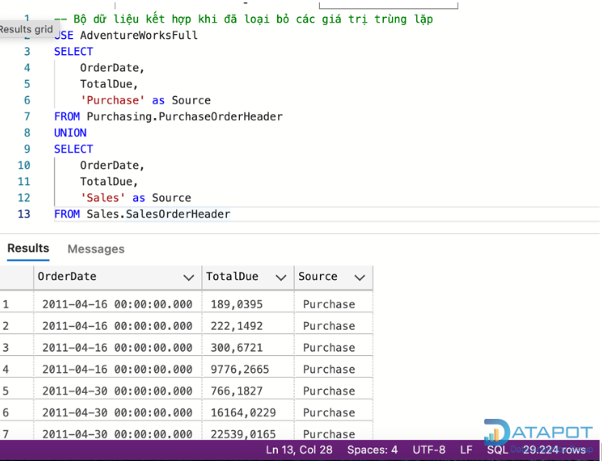
- Giải thích câu lệnh truy vấn:
    - FROM: Dữ liệu được lấy từ bảng PurchaseOrderHeader, SalesOrderHeader.
    - UNION: Gộp các cột không bao gồm các dòng trùng lặp giữa 2 bảng với nhau.

#### 2.2 UNION ALL
- Tương tự như UNION, UNION ALL kết hợp cột từ hai hay nhiều mệnh đề SELECT theo chiều dọc. Tuy nhiên, không loại bỏ các dòng trùng lặp nếu có.
- Đặc điểm:
    - Khi UNION ALL các câu lệnh SELECT cần trả về số cột dữ liệu bằng nhau.
    - Các cột tương ứng cần có cùng kiểu dữ liệu.
    - UNION ALL sẽ gộp cả NULL.
- Cú pháp của UNION ALL:
    ```
    SELECT
         Col_1,
         Col_2,...
     FROM Table_1
     UNION ALL
     SELECT
     Col_1,
     Col_2,...
     FROM Table_2
    ```
- Ví dụ: Kết hợp các đơn hàng từ Purchasing sources và Sales sources, sử dụng gộp tất cả (UNION ALL).
Tổng số hàng trả về 35.477.
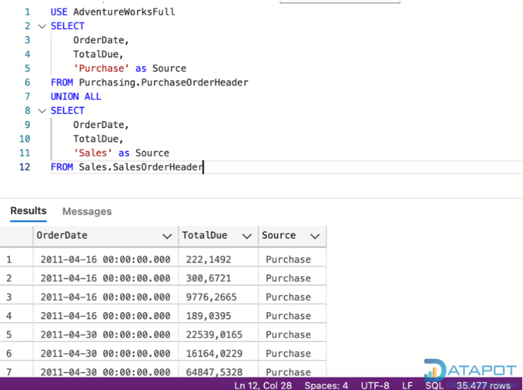
- Giải thích câu lệnh truy vấn:
    - FROM: Dữ liệu được lấy từ bảng PurchaseOrderHeader, SalesOrderHeader.
    - UNION ALL: Gộp các cột giữ nguyên các dòng trùng lặp giữa 2 bảng với nhau.
  
**Phân biệt giữa JOIN và UNION.**
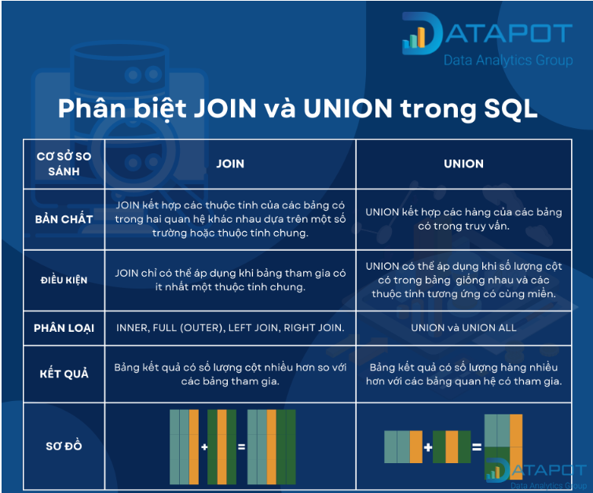
## IV Tổng hợp và nhóm dữ liệu: COUNT, SUM, AVG, GROUP BY
### 1.COUNT
- Hàm **COUNT()** dùng để đếm số lượng hàng trong một bảng hoặc một nhóm. Có thể sử dụng COUNT(*) để đếm tất cả các hàng. Hoặc bạn có thể sử dụng COUNT(column_name) để đếm số lượng giá trị không NULL trong một cột.
- Ví dụ:
    ```
    SELECT COUNT(*) FROM customers;
    ```
- Câu lệnh này sẽ trả về tổng số khách hàng trong bảng **customers.**
### 2.SUM
- Hàm **SUM()** dùng để tính tổng các giá trị trong một cột. Cột phải có kiểu dữ liệu số. Hàm này bỏ qua các giá trị NULL.
- Ví dụ:
    ```
    SELECT SUM(order_total) FROM orders;
    ```
- Câu lệnh này sẽ trả về tổng giá trị của tất cả các đơn hàng trong bảng orders.
### 3.AVG
- Hàm **AVG()** dùng để tính giá trị trung bình của các giá trị trong một cột. Cột phải có kiểu dữ liệu số. Hàm này cũng bỏ qua các giá trị NULL.
- Ví dụ:
    ```
    SELECT AVG(product_price) FROM products;
    ```
- Câu lệnh này sẽ trả về giá trung bình của tất cả các sản phẩm trong bảng
### 4.Gom Nhóm Dữ Liệu với GROUP BY
- Mệnh đề **GROUP BY** dùng để gom nhóm các hàng có cùng giá trị trong một hoặc nhiều cột. Điều này cho phép bạn áp dụng các hàm tổng hợp cho từng nhóm.
- Ví dụ:
    ```
    SELECT category, COUNT(*) FROM products GROUP BY category;
    ```
- Câu lệnh này sẽ trả về số lượng sản phẩm trong mỗi danh mục.
- Có thể gom nhóm theo nhiều cột. Thứ tự của các cột trong mệnh đề GROUP BY quan trọng.
    - Ví dụ:
        ```
        SELECT category, supplier, COUNT(*) FROM products GROUP BY category, supplier;
        ```
    - Câu lệnh này sẽ trả về số lượng sản phẩm trong mỗi danh mục và nhà cung cấp.
## V. Subquery
- **SUBQUERY** - Truy vấn con là một truy vấn bên trong truy vấn SQL khác và được nhúng bên trong mệnh đề WHERE. Yếu tố này còn được gọi truy vấn phụ hay truy vấn lồng nhau.
- Truy vấn con trả về dữ liệu sẽ sử dụng trong truy vấn chính, được xem như là một điều kiện để thu hẹp dữ liệu thu nhận.
- Các truy vấn con có thể được sử dụng với các lệnh SELECT, INSERT, UPDATE VÀ DELETE cùng với các toán tử như =, <, >, >=, <=, IN, BETWEEN...
- Truy vấn con phải tuân theo các quy tắc sau:
    - SUBQUERY phải nằm trong các dấu ngoặc đơn.
    - Một SUBQUERY có thể chỉ có một cột trong mệnh đề SELECT, trừ khi nhiều cột trong truy vấn chính cho SUBQUERY để so sánh các cột đã chọn của nó.
    - Một ORDER BY không thể được sử dụng trong một truy vấn con, mặc dù truy vấn chính có thể sử dụng một ORDER BY. GROUP BY được sử dụng để thực hiện tính năng như ORDER BY trong một truy vấn con.
    - Truy vấn con trả về nhiều hơn một hàng chỉ có thể được sử dụng với toán tử nhiều giá trị như toán tử IN.
    - Danh sách SELECT không được bao gồm bất kỳ tham chiếu nào đến các giá trị đánh giá BLOB, ARRAY, CLOB hoặc NCLOB.
    - Truy vấn con không thể đi kèm set function.
    - Toán tử BETWEEN không thể được sử dụng với một truy vấn con tuy nhiên có thể được sử dụng bên trong truy vấn con.
### 5.1 SUBQUERY với lệnh SELECT trong SQL
- Các truy vấn con thường xuyên được sử dụng với lệnh SELECT. Cú pháp cơ bản như sau:
  
```
SELECT ten_cot [, ten_cot ]FROM bang1 [, bang2 ]WHERE ten_cot OPERATOR (SELECT ten_cot [, ten_cot ] FROM bang1 [, bang2 ] [WHERE])
```
Xét bảng NHANVIEN có các bản ghi sau:
| ID | TEN   | TUOI | DIACHI   | LUONG    |
|----|-------|------|----------|----------|
| 1  | Thanh | 32   | Haiphong | 2000.00  |
| 2  | Loan  | 25   | Hanoi    | 1500.00  |
| 3  | Nga   | 23   | Hanam    | 2000.00  |
| 4  | Manh  | 25   | Hue      | 6500.00  |
| 5  | Huy   | 27   | Hatinh   | 8500.00  |
| 6  | Cao   | 22   | HCM      | 4500.00  |
| 7  | Lam   | 24   | Hanoi    | 10000.00 |

Kiểm tra truy vấn con với lệnh SELECT như sau:
```
SELECT *  FROM NHANVIEN WHERE ID IN (SELECT ID  FROM NHANVIEN WHERE LUONG > 4500);
```
Kết quả trả về là:
| ID | TEN  | TUOI | DIACHI | LUONG    |
|----|------|------|--------|----------|
| 4  | Manh | 25   | Hue    | 6500.00  |
| 5  | Huy  | 27   | Hatinh | 8500.00  |
| 7  | Lam  | 24   | Hanoi  | 10000.00 |

### 5.2 SUBQUERY với lệnh INSERT trong SQL
- Truy vấn con cũng có thể được sử dụng với các câu lệnh INSERT. Câu lệnh INSERT sử dụng dữ liệu được trả về từ truy vấn con để chèn vào một bảng khác. Dữ liệu đã chọn trong truy vấn con có thể được sửa đổi bằng bất kỳ ký tự, hàm date/time hoặc hàm number nào.
- Cú pháp cơ bản như sau:
```
INSERT INTO ten_bang [ (cot1 [, cot2 ]) ] SELECT [ *|cot1 [, cot2 ] FROM bang1 [, bang2 ] [ WHERE GIA_TRI TOAN_TU ]
```
Theo dõi bảng NHANVIEN_QTM với cấu trúc tương tự như bảng NHANVIEN. Bây giờ, sao chép cả bảng NHANVIEN vào trong bảng NHANVIEN_QTM, có thể sử dụng cú pháp sau:
```
INSERT INTO NHANVIEN_QTM SELECT * FROM NHANVIEN WHERE ID IN (SELECT ID  FROM NHANVIEN);
```
### 5.3 SUBQUERY với lệnh UPDATE trong SQL
- Có thể sử dụng truy vấn con kết hợp với câu lệnh UPDATE. Một hoặc nhiều cột trong một bảng có thể được cập nhật khi sử dụng một truy vấn con với câu lệnh UPDATE.
- Cú pháp cơ bản như sau:
```
UPDATE bangSET ten_cot = giatri_moi[ WHERE TOAN_TU [ GIA_TRI ] (SELECT TEN_COT FROM TEN_BANG) [ WHERE) ]
```
Giả sử ta có bảng NHANVIEN_QTM có sẵn là bảng sao lưu của NHANVIEN. Ví dụ sau cập nhật LUONG gấp 2 lần trong bảng NHANVIEN cho tất cả khách hàng có LUONG lớn hơn hoặc bằng 27:
```
UPDATE NHANVIEN SET LUONG = LUONG * 2 WHERE TUOI IN (SELECT TUOI FROM NHANVIEN_QTM WHERE TUOI >= 27 );
```
Lệnh này tác động lên hai hàng và cuối cùng bảng NHANVIEN sẽ có các bản ghi sau:
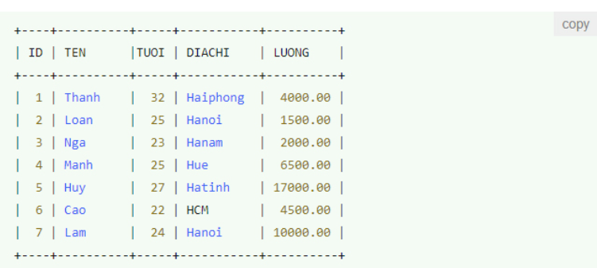
### 5.4 SUBQUERY với lệnh DELETE trong SQL
- Các truy vấn con cũng được sử dụng với lệnh DELETE và ta có cú pháp cơ bản như sau:
```
DELETE FROM TEN_BANG[ WHERE TOAN_TU [ GIA_TRI ] (SELECT TEN_COT FROM TEN_BANG) [ WHERE) ]
```
Giả sử ta có bảng NHANVIEN_QTM có sẵn mà là sao lưu của bảng NHANVIEN. Ví dụ sau sẽ xóa các bản ghi từ bảng NHANVIEN có TUOI lớn hơn hoặc bằng 27.
```
DELETE FROM NHANVIEN WHERE TUOI IN (SELECT TUOI FROM NHANVIEN_QTM WHERE TUOI >= 27);
```
Lệnh này tác động lên hai hàng và cuối cùng bảng NHANVIEN sẽ có các bản ghi sau:
| ID | TEN  | TUOI | DIACHI | LUONG    |
|----|------|------|--------|----------|
| 2  | Loan | 25   | Hanoi  | 1500.00  |
| 3  | Nga  | 23   | Hanam  | 2000.00  |
| 4  | Manh | 25   | Hue    | 6500.00  |
| 6  | Cao  | 22   | HCM    | 4500.00  |
| 7  | Lam  | 24   | Hanoi  | 10000.00 |

## VI.Thứ tự thực thi logic của truy vấn
- Thứ tự thực thi logic của truy vấn:
- Khi SQL thực thi, nó sẽ tuân theo thứ tự logic như sau:
```
FROM >> JOIN >> ON >> WHERE >> GROUP BY >> HAVING >> SELECT >> ORDER BY >> LIMIT 
```
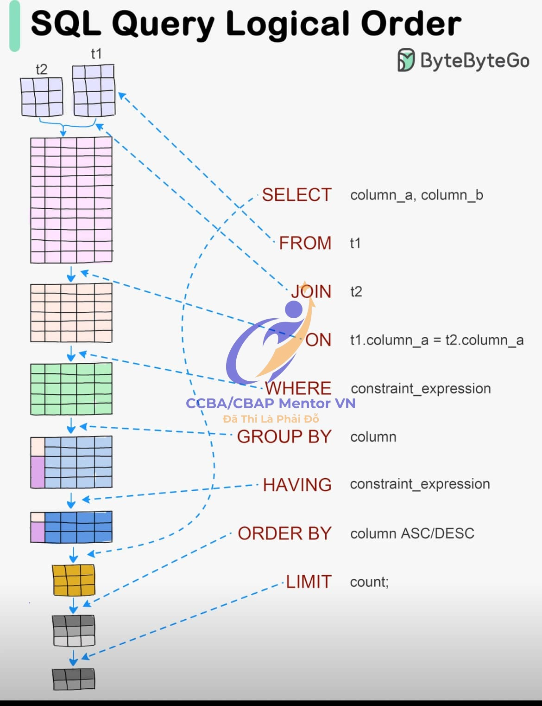
### 1. FROM:
• Mô tả: Đầu tiên, SQL xác định bảng chính (trong ví dụ này là t1) mà dữ liệu sẽ được lấy từ đó. Đây là bước đầu tiên để xác định tập dữ liệu cơ bản mà các câu lệnh khác sẽ thao tác trên đó.
• Ý nghĩa: Việc chọn bảng chính là nền tảng để từ đó thực hiện các thao tác khác như lọc, nhóm, hoặc kết hợp với các bảng khác.
### 2. JOIN:
• Mô tả: Nếu truy vấn có sự kết hợp giữa hai hoặc nhiều bảng, bước này thực hiện phép JOIN để kết hợp các bảng lại với nhau. Trong hình, t1 được kết hợp với t2.
• Ý nghĩa: Việc kết hợp bảng giúp lấy dữ liệu liên quan từ nhiều bảng khác nhau dựa trên điều kiện kết hợp.
### 3. ON:
• Mô tả: Sau khi xác định các bảng cần kết hợp, SQL áp dụng điều kiện ON để lọc các dòng từ hai bảng mà chúng có giá trị tương ứng trong các cột chỉ định (ví dụ t1.column_a = t2.column_a).
• Ý nghĩa: Điều kiện này đảm bảo rằng chỉ những dòng có dữ liệu phù hợp giữa các bảng mới được giữ lại trong tập kết quả.
### 4. WHERE:
• Mô tả: SQL tiếp tục lọc dữ liệu từ bảng hoặc kết quả của phép JOIN dựa trên điều kiện được chỉ định trong mệnh đề WHERE.
• Ý nghĩa: Điều kiện WHERE giúp loại bỏ những dòng không phù hợp trước khi thực hiện các thao tác tiếp theo như nhóm hoặc sắp xếp.
### 5.GROUP BY:
• Mô tả: Sau khi dữ liệu đã được lọc, SQL nhóm các dòng theo một hoặc nhiều cột, tạo ra các tập hợp con của dữ liệu dựa trên giá trị của các cột đó.
• Ý nghĩa: Bước này quan trọng trong các truy vấn cần tính toán các giá trị tổng hợp (như tổng, trung bình) theo nhóm.
### 6. HAVING:
• Mô tả: Bước này là một bộ lọc tiếp theo, nhưng thay vì lọc dòng như WHERE, HAVING lọc các nhóm đã được tạo ra từ GROUP BY.
• Ý nghĩa: HAVING hữu ích trong việc lọc các nhóm dựa trên các điều kiện tổng hợp, ví dụ như chỉ giữ lại các nhóm có tổng giá trị lớn hơn một ngưỡng nhất định.
### 7. SELECT:
• Mô tả: Bây giờ, SQL xác định các cột cụ thể cần hiển thị trong kết quả cuối cùng từ các dòng hoặc nhóm đã được xử lý qua các bước trên.
• Ý nghĩa: SELECT là nơi bạn thực sự lấy ra dữ liệu mà bạn muốn hiển thị trong kết quả truy vấn.
### 8. ORDER BY:
• Mô tả: SQL sắp xếp các kết quả cuối cùng theo một hoặc nhiều cột được chỉ định trong mệnh đề ORDER BY, theo thứ tự tăng dần (ASC) hoặc giảm dần (DESC).
• Ý nghĩa: Sắp xếp dữ liệu giúp bạn trình bày kết quả một cách có trật tự và dễ hiểu hơn.
### 9. LIMIT:
• Mô tả: Cuối cùng, SQL chỉ lấy ra một số lượng dòng nhất định từ kết quả sau khi đã sắp xếp, dựa trên giới hạn mà bạn đặt ra trong mệnh đề LIMIT.
• Ý nghĩa: LIMIT giúp bạn giới hạn số lượng kết quả trả về, rất hữu ích trong các trường hợp bạn chỉ muốn xem một số dòng nhất định từ kết quả truy vấn. 

