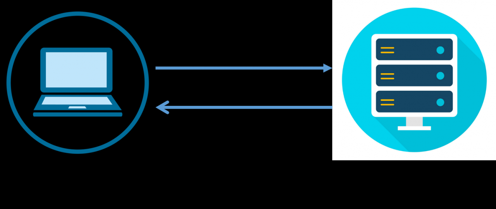
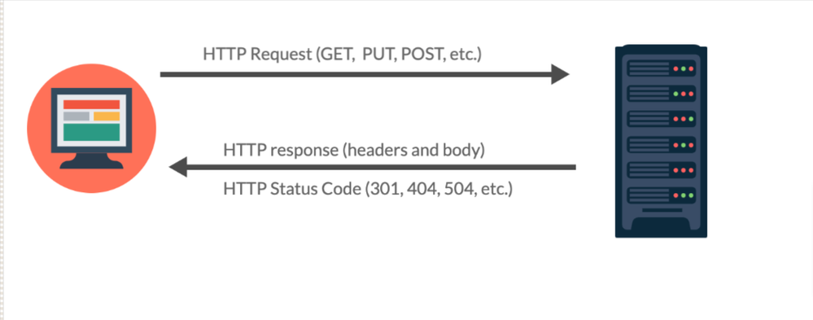
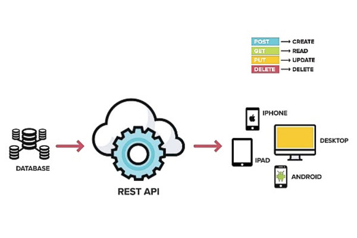
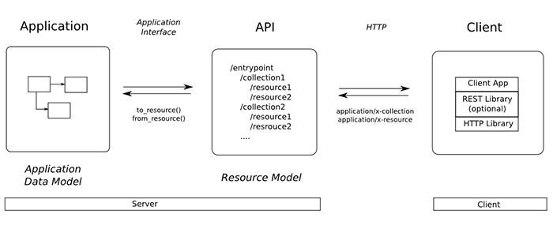

# BUỔI 5: CÁC KIẾN THỨC CƠ BẢN
## I. HTTP là gì
### 1. Khái niệm
- **HTTP (HyperText Transfer Protocol)** là giao thức truyền tải siêu văn bản, được sử dụng phổ biến để trao đổi dữ liệu giữa trình duyệt `(client)` và máy chủ web `(server)`. Đây là một giao thức mạng, hoạt động ở lớp ứng dụng trong mô hình `TCP/IP` và là nền tảng cốt lõi của `World Wide Web`. Vai trò chính của **HTTP** là phương tiện để trình duyệt web `(Client)` và máy chủ web `(Server)` tương tác và trao đổi tài nguyên web như trang HTML, hình ảnh, video qua Internet. Trong đó
    - **Hypertext (Siêu văn bản)**: Đây không phải là văn bản thông thường. Nó là dạng văn bản chứa các liên kết `(links)`. Khi bạn nhấp vào một liên kết, bạn sẽ được chuyển đến một trang khác. Hầu hết mọi thứ bạn thấy trên web đều là siêu văn bản.
    - **Protocol (Giao thức)**: Đây là một bộ quy tắc. Giống như luật giao thông giúp các phương tiện di chuyển có trật tự, giao thức giúp các máy tính giao tiếp với nhau một cách thống nhất.
  
-> **HTTP** là bộ quy tắc chuẩn cho phép trình duyệt web của bạn và máy chủ web trao đổi các siêu văn bản. Nó chính là ngôn ngữ chung của Internet.
### 2. Cơ chế hoạt động của HTTP
- **HTTP** hoạt động dựa trên mô hình **Client-Server**, nơi trình duyệt của bạn đóng vai trò là client và máy chủ chứa website là Server. Mô hình client-server:
    - **Client (thường là trình duyệt web)**: Khởi tạo yêu cầu (Request) bằng cách nhập URL (Địa chỉ web) hoặc nhấp vào một liên kết để xin một tài nguyên web (trang HTML, file ảnh, video…).
    - **Server (máy chủ web)**: Là nơi chứa dữ liệu của website. Server lắng nghe, tiếp nhận yêu cầu từ client, xử lý và gửi lại phản hồi (Response) chứa tài nguyên được yêu cầu cùng mã trạng thái.
  


-> Toàn bộ quá trình lướt web của bạn là một chuỗi liên tục các yêu cầu và phản hồi này.
### 3. Các method trong HTTP
- **HTTP** là một giao thức không trạng thái, có nghĩa là mỗi yêu cầu `(request)` từ máy khách đến máy chủ đều độc lập và không lưu giữ thông tin về các yêu cầu trước đó. Để thực hiện các giao dịch qua **HTTP**, chúng ta sử dụng các phương thức `HTTP (HTTP Methods):
- **HTTP Methods** là các phương thức được sử dụng để xác định hành động mà máy khách yêu cầu máy chủ thực hiện đối với tài nguyên. Các phương thức này đóng vai trò quan trọng trong việc xác định loại yêu cầu mà máy khách muốn thực hiện, ví dụ như lấy dữ liệu, gửi dữ liệu, hay xóa dữ liệu.
- Phân loại **HTTP Methods**:
    - Khi làm việc với các **HTTP method**, sẽ thường nghe đến hai khái niệm quan trọng: tính an toàn `(Safe)` và tính `idempotent`. Chúng không phải là quy tắc ‘cứng’ mà server bắt buộc phải tuân theo, nhưng là những quy ước quan trọng giúp hệ thống hoạt động ổn định và dễ đoán hơn.
    - **Phương thức An toàn (Safe Methods)**
        - Một **phương thức HTTP** được coi là ‘an toàn’ nếu nó không làm thay đổi trạng thái của tài nguyên trên **server**. Nói cách khác, việc gọi phương thức này nhiều lần không gây ra bất kỳ tác dụng phụ nào trên **server**. Các phương thức an toàn điển hình bao gồm:
            - **GET**: Chỉ dùng để lấy dữ liệu, không thay đổi gì cả.
            - **HEAD**: Giống như GET, nhưng chỉ trả về các thông tin về tiêu đề của tài nguyên mà không có phần thân (body).
            - **OPTIONS**: Hỏi thông tin về các phương thức được hỗ trợ.
        -> Điều này có nghĩa là trình duyệt có thể tự do cache kết quả của các request GET mà không lo lắng gì.
    - **Phương thức Idempotent (Idempotent Methods)**
        - Một **phương thức HTTP** được coi là ‘idempotent’ nếu việc thực hiện yêu cầu đó nhiều lần liên tiếp với cùng một tham số sẽ cho ra cùng một kết quả cuối cùng trên server, giống như chỉ thực hiện một lần. 
        - Các phương thức idempotent bao gồm:
            - **GET, HEAD, OPTIONS**: Chúng vừa an toàn vừa idempotent.
            - **PUT**: Nếu bạn gửi cùng một **request PUT** nhiều lần để cập nhật một tài nguyên, trạng thái cuối cùng của tài nguyên đó vẫn sẽ giống nhau (nó sẽ được cập nhật với dữ liệu bạn gửi). Lần đầu tiên có thể tạo hoặc cập nhật, các lần sau chỉ là cập nhật lại y như vậy.
            - **DELETE**: Nếu bạn xóa một tài nguyên, lần đầu nó sẽ bị xóa. Các lần gọi DELETE tiếp theo với cùng tài nguyên đó (nếu server xử lý đúng) vẫn sẽ cho kết quả là tài nguyên đó không tồn tại. Trạng thái cuối cùng là ‘đã xóa’.
            - **POST**: Dùng để gửi dữ liệu đến máy chủ, thường dùng trong các biểu mẫu (forms) hoặc khi tạo mới tài nguyên. Thường không idempotent. Nếu bạn gửi cùng một request POST nhiều lần (ví dụ, đặt hàng hai lần), bạn có thể tạo ra hai tài nguyên riêng biệt (hai đơn hàng). 
            - **PATCH**: Tương tự như PUT, nhưng chỉ sửa đổi một phần tài nguyên, thay vì thay thế hoàn toàn.
  
#### Các HTTP Method quan trọng
| Method      | Ý nghĩa                           | Thường dùng để         | Ví dụ                         |
| ----------- | --------------------------------- | ---------------------- | ----------------------------- |
| **GET**     | Lấy dữ liệu                       | Đọc resource           | Lấy danh sách sinh viên       |
| **POST**    | Tạo dữ liệu mới                   | Thêm resource          | Tạo sinh viên mới             |
| **PUT**     | Cập nhật toàn bộ                  | Thay thế resource      | Cập nhật toàn bộ thông tin SV |
| **PATCH**   | Cập nhật một phần                 | Sửa một vài thuộc tính | Chỉ sửa email                 |
| **DELETE**  | Xóa dữ liệu                       | Xóa resource           | Xóa sinh viên                 |
| **HEAD**    | Giống GET nhưng không trả body    | Kiểm tra resource      | Kiểm tra file tồn tại         |
| **OPTIONS** | Cho biết server hỗ trợ method nào | Kiểm tra khả năng API  | CORS/preflight                |
### 4. Response là gì, Request là gì ?
#### 4.1 Response là gì
- **HTTP Response (Phản hồi HTTP)** là thông điệp mà máy chủ (server) gửi về cho trình duyệt (client) hoặc một ứng dụng khác sau khi nhận được một **HTTP Request**. Hãy hình dung đơn giản, khi bạn gõ một địa chỉ web vào trình duyệt và nhấn Enter, bạn đang gửi một yêu cầu (Request). Máy chủ sau đó sẽ xử lý yêu cầu này và gửi lại một phản hồi (Response) chứa dữ liệu mà bạn muốn xem, có thể là một trang web, một hình ảnh, hoặc dữ liệu dạng JSON.

- Phản hồi này không chỉ là dữ liệu mà còn bao gồm các thông tin quan trọng khác, cho biết liệu yêu cầu của bạn có thành công hay không, hoặc có vấn đề gì đã xảy ra trong quá trình xử lý. Việc hiểu cách phản hồi được cấu trúc và giải thích sẽ giúp bạn gỡ lỗi (debug) tốt hơn và viết code hiệu quả hơn.
- Ví dụ HTTP Response:
```
HTTP/1.1 200 OK 
Date: Wed, 23 Jun 2024 12:00:00 GMT 
Server: Apache 
Content-Type: text/html; charset=UTF-8 
Content-Length: 1234 

    Example Page 
  Hello, World!
```
##### HTTP Response có vai trò gì trong giao tiếp Web?
- **HTTP Response** có vai trò cực kỳ quan trọng, là cầu nối cuối cùng trong chu trình yêu cầu-phản hồi giữa `client` và `server`. Nó mang kết quả của mọi tương tác trên web.
- Chẳng hạn, khi đăng nhập vào một trang web, server cần thông báo cho bạn biết liệu việc đăng nhập có thành công hay không. Nếu thành công, nó gửi về dữ liệu trang cá nhân của bạn; nếu thất bại, nó thông báo lý do như "sai mật khẩu". Không có HTTP Response, trình duyệt sẽ không biết phải hiển thị gì hoặc làm gì tiếp theo.
- Phản hồi HTTP cũng đảm bảo tính toàn vẹn và bảo mật của dữ liệu. Các thông tin về bộ nhớ đệm (caching), loại nội dung, hay cơ chế xác thực đều được truyền tải qua Response. Điều này giúp các ứng dụng web vận hành mượt mà, nhanh chóng và an toàn.
- Response không chỉ đơn thuần là gửi dữ liệu. Nó mang nhiều thông điệp và chỉ dẫn quan trọng, quyết định cách client xử lý thông tin và tương tác tiếp theo với máy chủ. Chúng ta có thể xem xét một số vai trò chính của HTTP Response như sau:
    - **Phân phối nội dung:**
        - Vai trò cơ bản và dễ thấy nhất của HTTP Response là phân phối nội dung từ Server đến Client. Khi bạn yêu cầu một trang web, hình ảnh, video hay bất kỳ tài nguyên nào khác, Server sẽ gửi chúng về trong phần Body của Response.
        - Nhờ Response, Client có thể nhận được mã HTML để trình duyệt hiển thị thành trang web, dữ liệu JSON để ứng dụng xử lý, hoặc file để người dùng tải về, giúp người dùng truy cập thông tin trên web.
    - **Báo cáo trạng thái và xử lý lỗi**:
        - HTTP Response luôn chứa Mã trạng thái (Status Code) báo cáo kết quả xử lý yêu cầu. Mã trạng thái này là cách Server thông báo cho Client biết yêu cầu có thành công hay không, và nếu không, lý do là gì.
        - Vai trò này cực kỳ quan trọng cho việc xử lý lỗi. Client (hoặc lập trình viên) có thể dựa vào Status Code (như 404 Not Found, 500 Internal Server Error) để xác định vấn đề và đưa ra phản hồi phù hợp cho người dùng.
        - Ví dụ, khi bạn thấy trang báo lỗi “404 Not Found”, đó chính là thông tin từ Status Code trong HTTP Response, báo cho trình duyệt biết tài nguyên không tồn tại trên Server.
    - **Hỗ trợ Cache:**
        - HTTP Response có thể chứa các Tiêu đề (Headers) quan trọng cung cấp chỉ dẫn về việc lưu trữ tạm thời (cache) phản hồi này. Các Header như Cache-Control hoặc Expires đóng vai trò này.
        - Nhờ các chỉ dẫn này, Client hoặc máy chủ trung gian (proxy) có thể lưu bản sao của Response lại và sử dụng cho các yêu cầu tương tự tiếp theo mà không cần hỏi lại Server gốc, giúp cải thiện hiệu suất và giảm tải Server.
    - **Hỗ trợ đàm phán nội dung**
        - Headers trong HTTP Response cũng hỗ trợ quá trình “đàm phán nội dung”. Server có thể sử dụng các Header như Content-Type để cho Client biết định dạng và mã hóa của nội dung trong Body.
        - Điều này cho phép Client hiểu và xử lý nội dung phản hồi một cách chính xác, ví dụ trình duyệt biết cách hiển thị HTML hay ứng dụng biết cách parse (phân tích) dữ liệu JSON nhận được.
##### Cách hoạt động của HTTP Request/Response
- Để hiểu HTTP Response, cần nắm rõ chu trình giao tiếp cơ bản của HTTP:
    - **Bước 1**: Client (ví dụ: trình duyệt của bạn khi bạn gõ địa chỉ website) tạo và gửi một HTTP Request đến Server. Request này chứa thông tin về tài nguyên Client muốn truy cập (URL), phương thức hành động (GET, POST, v.v.), và các thông tin bổ sung trong Header.
    - **Bước 2**: Server nhận Request, xử lý yêu cầu đó (ví dụ: tìm trang web, xử lý dữ liệu form, truy vấn cơ sở dữ liệu).
    - **Bước 3**: Server tạo và gửi một HTTP Response trở lại cho Client. Response này chứa kết quả xử lý yêu cầu, bao gồm trạng thái của yêu cầu và dữ liệu (nếu có).
    - **Bước 4:** Client nhận Response và xử lý nó (ví dụ: trình duyệt hiển thị trang web, ứng dụng di động cập nhật giao diện người dùng).
##### Cấu trúc cơ bản của HTTP Response
- Một **HTTP Response** thông thường được cấu thành từ ba phần chính, mỗi phần mang một loại thông tin đặc thù. Việc hiểu rõ cấu trúc này giúp bạn dễ dàng đọc và phân tích các phản hồi từ server.
- Ba thành phần đó là:
    - **Status Line (Dòng Trạng Thái)**
    - **HTTP Headers (Các Tiêu Đề HTTP)**
    - **HTTP Response Body (Phần Thân Phản Hồi HTTP)**
###### Status Line (Dòng Trạng Thái)
- Đây là dòng đầu tiên và rất quan trọng của HTTP Response trong HTTP/1.1. Nó cung cấp cái nhìn tổng quan về kết quả xử lý yêu cầu ngay lập tức cho client.
- Dòng trạng thái bao gồm ba thông tin: phiên bản giao thức HTTP (ví dụ: HTTP/1.1), mã trạng thái (Status Code), và một đoạn văn bản mô tả ngắn gọn về mã trạng thái đó (Status Text).
- Ví dụ: HTTP/1.1 200 OK. Dòng này cho biết Server dùng HTTP/1.1, yêu cầu thành công (mã 200), và mô tả là “OK”.
- Mã trạng thái là phần then chốt của Dòng trạng thái, Nó là con số quyết định Client cần làm gì tiếp theo với Response này. 
- **Mã Trạng Thái (Status Codes)** là một con số gồm ba chữ số được đặt ở đầu tiên trong **Status Line** của một HTTP Response. Nó là tín hiệu quan trọng nhất từ server, cho bạn biết kết quả của yêu cầu HTTP mà client đã gửi. - Ví dụ: "404 Not Found" khi truy cập một trang không tồn tại.

- Có năm loại **HTTP Status Code** chính, được phân loại dựa trên chữ số đầu tiên của mã:
    - **1xx (Informational - Thông tin)**: 
        - Yêu cầu đã được nhận và quá trình đang tiếp tục. Chúng thường mang tính tạm thời. 
        - Ví dụ: 100 Continue (Server đã nhận được headers của request và client nên tiếp tục gửi body của request nếu cần).
    - **2xx (Success - Thành công)**: 
        - Yêu cầu đã được server nhận, hiểu và chấp nhận thành công. Đây là nhóm mã trạng thái mà bạn muốn thấy nhất. 
        - **200 OK**: Yêu cầu thành công. Phổ biến nhất.
        - **201 Created**: Yêu cầu tạo một tài nguyên mới thành công (ví dụ: tạo user, bài viết).
        - **204 No Content**: Yêu cầu thành công nhưng không có nội dung nào được trả về trong Body (ví dụ: xóa thành công một tài nguyên).
    - **3xx (Redirection - Chuyển hướng)**: 
        - Client cần thực hiện một hành động bổ sung để hoàn tất yêu cầu. Thường dùng để điều hướng trình duyệt đến một URL khác. 
        - **301 Moved Permanently**: Tài nguyên đã chuyển đến URL mới vĩnh viễn.
        - **302 Found (trước đây là Moved Temporarily)**: Tài nguyên tạm thời ở URL khác.
        - **304 Not Modified**: Tài nguyên chưa thay đổi kể từ lần cuối Client yêu cầu (sử dụng cache của Client).
    - **4xx (Client Errors - Lỗi từ phía client)**: 
        - Yêu cầu chứa cú pháp không chính xác hoặc không thể được thực hiện. Đây là lỗi do client gây ra.
        - **400 Bad Request**: Server không hiểu cú pháp của Request.
        - **401 Unauthorized**: Client cần xác thực để truy cập tài nguyên.
        - **403 Forbidden**: Client đã xác thực nhưng không có quyền truy cập tài nguyên này.
        - **404 Not Found**: Server không tìm thấy tài nguyên được yêu cầu (URL không tồn tại).
        - **405 Method Not Allowed**: Phương thức HTTP (GET, POST) không được phép cho tài nguyên này.
        - **408 Request Timeout**: Server không nhận đủ Request trong thời gian quy định.
    - **5xx (Server Errors - Lỗi từ phía server)**: 
        - Server không thể hoàn thành yêu cầu hợp lệ. Đây là lỗi do server gây ra. 
        - **500 Internal Server Error**: Lỗi chung chung của Server.
        - **503 Service Unavailable**: Server hiện không thể xử lý Request (quá tải hoặc đang bảo trì).
        - **504 Gateway Timeout**: Server đóng vai trò Gateway hoặc Proxy và không nhận được phản hồi kịp thời từ Server Upstream.
- Mỗi mã trạng thái đều có một ý nghĩa cụ thể, và việc hiểu chúng là nền tảng để gỡ lỗi và phát triển ứng dụng web vững chắc.
###### HTTP Headers trong Response 
- **HTTP Headers trong Response** là các cặp khóa-giá trị `(key-value pairs)` cung cấp thông tin bổ sung về phản hồi, về server, hoặc về cách client nên xử lý dữ liệu. Chúng được đặt ngay sau Status Line và trước Response Body.
- Có thể ví HTTP Headers như một bộ danh thiếp kèm theo món quà. Món quà (body) là thứ bạn muốn, nhưng danh thiếp (headers) cho bạn biết món quà đó là gì, nó được gói như thế nào, và bạn nên làm gì với nó.
- Một số loại HTTP Header phổ biến trong Response mà bạn thường gặp:
    - **Content-Type**: 
        - Header này cực kỳ quan trọng, cho biết loại dữ liệu mà Response Body đang chứa. 
        - Ví dụ: Content-Type: text/html cho biết body là một trang HTML, Content-Type: application/json cho biết body là dữ liệu JSON, hay Content-Type: image/jpeg cho biết là một hình ảnh JPEG. Client sẽ dựa vào header này để biết cách hiển thị hoặc xử lý nội dung.
    - **Content-Length**: 
        - Chỉ ra kích thước (độ dài) của Response Body tính bằng byte. Header này giúp client biết khi nào việc nhận dữ liệu đã hoàn tất.
    - **Date**: Cho biết thời gian mà Response được tạo ra trên server. Thông tin này hữu ích cho việc kiểm tra đồng bộ thời gian và quản lý cache.
    - **Server**: 
        - Cung cấp thông tin về phần mềm web server đã tạo ra Response này (ví dụ: Apache, Nginx, IIS). Mặc dù hữu ích, đôi khi các server được cấu hình để ẩn thông tin này vì lý do bảo mật.
    - **Set-Cookie**: 
        - Server sử dụng header này để gửi một cookie mới hoặc cập nhật một cookie hiện có cho client. Client sẽ lưu trữ cookie này và gửi lại trong các Request tiếp theo đến cùng một domain. Đây là cách mà các phiên (sessions) người dùng và thông tin đăng nhập được duy trì.
    - **Cache-Control**: 
        - Header này kiểm soát cách client (trình duyệt) hoặc các proxy trung gian lưu trữ (cache) Response. 
        - Ví dụ: Cache-Control: no-cache yêu cầu client phải xác thực lại với server trước khi sử dụng phiên bản đã lưu trong cache, hoặc Cache-Control: max-age=3600 cho phép client lưu Response trong 3600 giây. Việc sử dụng Cache-Control đúng cách có thể cải thiện đáng kể tốc độ tải trang.
    - **Expires**: 
        - Một header cũ hơn Cache-Control, cũng dùng để kiểm soát cache bằng cách cung cấp ngày/giờ cụ thể mà Response được coi là đã hết hạn.
    - **Location**: 
        - Thường đi kèm với các mã trạng thái chuyển hướng (3xx), header Location cho client biết URL mới mà nó cần truy cập để hoàn tất yêu cầu. 
        - Ví dụ, sau khi đăng nhập thành công, server có thể gửi Location: /dashboard để chuyển hướng bạn đến trang tổng quan.
    - **WWW-Authenticate**: 
        - Được sử dụng trong các phản hồi 401 Unauthorized, header này cho biết phương thức xác thực mà server yêu cầu để client có thể truy cập tài nguyên.
Mỗi header đều có mục đích riêng và góp phần vào việc truyền tải thông tin hiệu quả giữa client và server. Việc hiểu và thao tác với các headers là một kỹ năng quan trọng đối với các nhà phát triển web.

###### HTTP Response Body 
- **HTTP Response Body** là phần cuối cùng và thường là phần lớn nhất của một HTTP Response. Đây chính là "nội dung" thực sự mà server gửi về cho client sau khi xử lý yêu cầu.
- Nếu bạn yêu cầu một trang web, Response Body chính là mã HTML của trang web đó. Nếu bạn yêu cầu một hình ảnh, Response Body sẽ là dữ liệu nhị phân của hình ảnh.
- Response Body thường chứa đựng các loại dữ liệu sau, tùy thuộc vào loại tài nguyên mà client yêu cầu và Content-Type header:
    - **HTML (HyperText Markup Language)**: Đây là loại dữ liệu phổ biến nhất khi bạn truy cập các trang web thông thường. Trình duyệt nhận mã HTML và hiển thị trang web tương ứng.
    - **JSON (JavaScript Object Notation)**: Rất phổ biến trong các API (Application Programming Interface), JSON là định dạng dữ liệu nhẹ, dễ đọc cho cả con người và máy móc. Nó thường được sử dụng để truyền tải dữ liệu có cấu trúc giữa client và server.
    - **XML (Extensible Markup Language)**: Tương tự như JSON, XML cũng là một định dạng dữ liệu có cấu trúc, mặc dù ít phổ biến hơn JSON trong phát triển web hiện đại.
    - **Văn bản thuần túy (Plain Text)**: Đôi khi, Response Body chỉ chứa văn bản không định dạng, ví dụ như log lỗi hoặc các thông báo đơn giản.
    - **Hình ảnh (Images)**: Khi bạn yêu cầu một file ảnh (JPEG, PNG, GIF, SVG), Response Body sẽ chứa dữ liệu nhị phân của hình ảnh đó.
    - **Video và Audio**: Tương tự như hình ảnh, các file đa phương tiện cũng được truyền tải qua Response Body.
    - **File khác**: Bất kỳ loại file nào khác như PDF, CSS, JavaScript, hoặc file nén (ZIP, RAR) cũng có thể được truyền tải qua Response Body.
Điều quan trọng là `Response Body` có thể `trống rỗng` trong một số trường hợp. Ví dụ, khi server gửi lại mã trạng thái 204 No Content, có nghĩa là yêu cầu đã thành công nhưng không có nội dung nào để gửi về. Tương tự, một yêu cầu với phương thức HEAD (chỉ yêu cầu headers, không yêu cầu body) cũng sẽ nhận được Response Body trống.
#### 4.2 Request là gì
- Trong lập trình, request (yêu cầu) là một thông điệp được gửi từ một chương trình máy tính (client) tới một chương trình máy tính khác (server) để yêu cầu một hành động hoặc một tài nguyên cụ thể. Nó là một phần cốt lõi của giao tiếp giữa các hệ thống trong môi trường mạng, đặc biệt là trên web.
- Nó giống như bạn đang gọi điện tới tổng đài dịch vụ để yêu cầu thông tin hoặc thực hiện giao dịch. Cuộc gọi của bạn chính là HTTP Request, mang theo thông tin bạn muốn và yêu cầu của bạn. Server sẽ lắng nghe và phản hồi lại yêu cầu đó.
- Theo định nghĩa từ các nhà phát triển, HTTP Request là tập các phương thức được định nghĩa để có thể thực hiện một số hành động dựa trên các tài nguyên gửi lên cho web server. Mọi tương tác của người dùng trên web đều bắt nguồn từ chuỗi Request.
- Về bản chất, Request giống như việc gửi một lá thư kỹ thuật số đến địa chỉ cụ thể (URL trên server) với yêu cầu rõ ràng (Method). Lá thư này còn có “tiêu đề” kèm theo thông tin bổ sung (Headers) và đôi khi cả “nội dung” dữ liệu cần gửi (Body).
##### Thành phần chính của một HTTP Request
- **Request Line** dòng đầu tiên trong một HTTP Request, bao gồm ba thành phần chính: phương thức (method), đường dẫn (path hay URL), và phiên bản HTTP (HTTP version).
    - **Method**: Có nhiều loại method, trong đó phổ biến nhất là GET và POST. Phương thức GET thường được sử dụng để yêu cầu tài nguyên có trong URL.
    - **Path (URL)**: Dùng để xác định tài nguyên mà client yêu cầu. Đường dẫn này bắt buộc phải bắt đầu bằng dấu “/”.
    - **HTTP version**: Là phiên bản giao thức HTTP được sử dụng
    
    - Ví dụ về một Request Line:
        ```
        GET /index.html HTTP/1.1
        ```

- **HTTP Request Headers**: Header chứa các thông tin bổ sung được gửi kèm theo yêu cầu giữa client và server, chẳng hạn như: cookie, thông tin xác thực, hoặc user-agent. **Header phân biệt chữ hoa và chữ thường**, được viết theo định dạng: tên header, theo sau là dấu “:” và một giá trị cụ thể.
    - **Host**: Tên miền của server.
    - **User-Agent**: Thông tin về client (trình duyệt, hệ điều hành).
    - **Accept**: Loại dữ liệu mà client có thể chấp nhận.
    - **Content-Type**: Loại dữ liệu được gửi trong body (chỉ có trong các Request có body).
    - Ví dụ về các headers:
    ```
       Host: www.example.com
       User-Agent: Mozilla/5.0
       Accept: text/html
    ```
- **Body (Tùy chọn)**:
    - Phần body chứa dữ liệu được gửi đi (chỉ áp dụng cho các phương thức như POST, PUT). Dữ liệu trong body thường được định dạng theo kiểu JSON, XML hoặc form data.
    - Ví dụ về body của một HTTP POST Request:
    ```
    {
    "username": "exampleUser",
    "password": "examplePass"
    }
## II. API là gì, RestAPI là gì ?
### 1. API là gì
#### Khái niệm
**API (Application Programming Interface - Giao diện lập trình ứng dụng)** là một tập hợp các quy tắc cho phép các phần mềm khác nhau kết nối và trao đổi dữ liệu với nhau. Nói đơn giản, API giúp các chương trình máy tính "nói chuyện" với nhau một cách hiệu quả. 
- Ví dụ: Hãy tưởng tượng API giống như một nhà hàng:
    - Khách hàng: Người dùng, đưa ra yêu cầu (đặt món ăn).
    - Người phục vụ: API client, nhận yêu cầu từ khách và truyền tải cho bếp với mã hoặc ký hiệu mà bếp hiểu.
    - Nhà bếp: API server, chế biến món ăn theo yêu cầu và gửi lại cho người phục vụ.
    - Khách hàng: Nhận được món ăn từ người phục vụ, tương ứng với dữ liệu hoặc nội dung mong muốn từ API.
#### Các loại API 
Có nhiều cách để phân loại API, nhưng một trong những cách phổ biến nhất là dựa trên phạm vi truy cập. Dưới đây là các loại API chính:

##### API riêng tư (Private APIs)
- Còn được gọi là API nội bộ, chỉ được sử dụng để kết nối các thành phần phần mềm trong một tổ chức duy nhất và không dành cho bên thứ ba.
- Ví dụ: Một ứng dụng mạng xã hội có thể có một API riêng để xử lý quy trình đăng nhập, một API khác để quản lý nguồn cấp dữ liệu (feed), và một API nữa để hỗ trợ giao tiếp giữa người dùng. Một ứng dụng có thể chứa hàng chục, thậm chí hàng trăm API riêng tư như vậy.
##### API công khai (Public APIs)
- API công khai cho phép truy cập vào dữ liệu, chức năng hoặc dịch vụ của một tổ chức, giúp các lập trình viên bên thứ ba tích hợp chúng vào ứng dụng của họ.
- Một số API công khai miễn phí, trong khi số khác được cung cấp dưới dạng sản phẩm trả phí.
- Ví dụ: Một ứng dụng thương mại điện tử có thể sử dụng API thanh toán công khai như Paypal để xử lý thanh toán mà không cần tự xây dựng chức năng đó từ đầu.
##### API đối tác (Partner APIs)
- API đối tác cho phép hai hoặc nhiều công ty chia sẻ dữ liệu hoặc chức năng để hợp tác trong một dự án.

- Những API này không công khai và thường sử dụng cơ chế xác thực để đảm bảo chỉ những đối tác được ủy quyền mới có thể sử dụng.
  
### 2. RestAPI là gì ?
- **REST (REpresentational State Transfer)** là một dạng chuyển đổi cấu trúc dữ liệu, một kiểu kiến trúc để viết API. Nó sử dụng phương thức HTTP đơn giản để tạo cho giao tiếp giữa các máy. Vì vậy, thay vì sử dụng một URL cho việc xử lý một số thông tin người dùng, REST gửi một yêu cầu HTTP như GET, POST, DELETE, vv đến một URL để xử lý dữ liệu.


- **RESTful API** là một tiêu chuẩn dùng trong việc thiết kế API cho các ứng dụng web (thiết kế Web services) để tiện cho việc quản lý các resource. Nó chú trọng vào tài nguyên hệ thống (tệp văn bản, ảnh, âm thanh, video, hoặc dữ liệu động…), bao gồm các trạng thái tài nguyên được định dạng và được truyền tải qua HTTP.


- Chức năng quan trọng nhất của REST là quy định cách sử dụng các HTTP method (như GET, POST, PUT, DELETE…) và cách định dạng các URL cho ứng dụng web để quản các resource. RESTful không quy định logic code ứng dụng và không giới hạn bởi ngôn ngữ lập trình ứng dụng, bất kỳ ngôn ngữ hoặc framework nào cũng có thể sử dụng để thiết kế một RESTful API.
#### RESTful hoạt động

- Client gửi một yêu cầu đến máy chủ. Client làm theo tài liệu API để định dạng yêu cầu theo cách mà máy chủ hiểu được.
- Máy chủ xác thực và xác nhận máy khách có quyền đưa ra yêu cầu đó.
- Máy chủ nhận yêu cầu và xử lý trong nội bộ.
- Máy chủ trả về một phản hồi đến client. Phản hồi chứa thông tin cho client biết liệu yêu cầu có thành công hay không. Phản hồi cũng bao gồm bất kỳ thông tin nào mà client yêu cầu.
## III. Design pattern : DI, IOC
### 1. DI Dependency Injection
- DI là một design pattern cho phép tách biệt việc tạo đối tượng khỏi việc sử dụng chúng. Thay vì một lớp tự tạo ra các đối tượng phụ thuộc, DI cung cấp các đối tượng này từ bên ngoài, giúp giảm sự phụ thuộc và tăng tính linh hoạt của ứng dụng.
#### Các Loại Dependency Injection trong Java
##### Constructor Injection
- Constructor Injection là phương thức phổ biến nhất trong DI, nơi các phụ thuộc được cung cấp thông qua constructor của lớp. Phương thức này đảm bảo rằng tất cả các phụ thuộc cần thiết được cung cấp ngay khi đối tượng được tạo ra, giúp đảm bảo tính nhất quán và giảm thiểu khả năng xuất hiện trạng thái không hợp lệ.
- **Ví dụ:**

    ```
    public class Service {
    private final Repository repository;

    public Service(Repository repository) {
        this.repository = repository;
    }

    // Các phương thức khác
    }

    ```

Trong ví dụ trên, lớp Service nhận một đối tượng Repository thông qua constructor, đảm bảo rằng Service luôn có một Repository hợp lệ khi được tạo ra.

##### Setter Injection
- Setter Injection cung cấp các phụ thuộc thông qua các phương thức setter. Phương thức này cho phép thay đổi các phụ thuộc sau khi đối tượng đã được tạo ra, mang lại tính linh hoạt cao hơn nhưng cũng có thể dẫn đến trạng thái không nhất quán nếu các phụ thuộc không được thiết lập đúng cách.

- **Ví dụ:**

    ```
    public class Service {
    private Repository repository;

    public void setRepository(Repository repository) {
        this.repository = repository;
    }

    // Các phương thức khác
    }
    ```

Trong ví dụ trên, lớp Service cung cấp một phương thức setter để thiết lập Repository sau khi đối tượng đã được tạo ra.

##### Field Injection
- Field Injection cung cấp các phụ thuộc trực tiếp vào các trường (fields) của lớp, thường thông qua các framework DI như Spring. Phương thức này giúp giảm thiểu mã nguồn nhưng có thể làm giảm tính rõ ràng và khả năng kiểm tra của mã.

- **Ví dụ:**
    ```
    public class Service {
    @Autowired
    private Repository repository;

    // Các phương thức khác
    }
    ```

Trong ví dụ trên, annotation @Autowired của Spring được sử dụng để tự động tiêm Repository vào trường repository của lớp Service.

Mỗi phương thức DI có ưu và nhược điểm riêng, và việc lựa chọn phương thức phù hợp phụ thuộc vào yêu cầu cụ thể của ứng dụng và framework được sử dụng.
### 2.IoC – Inversion of Control
Inversion of Control (IoC) dịch là đảo ngược điều khiển. Ý của nó là làm thay đổi luồng điều khiển của ứng dụng, giúp tăng tính mở rộng của một hệ thống.

IoC được chia thành 2 loại:
    - **Dependency Lookup** : sẽ tìm kiếm đối tượng phụ thuộc trong khung chứa IoC và sau đó chúng ta có thể dùng code để đưa đối tượng phụ thuộc vào trong đối tượng bị phụ thuộc. Dependency Lookup được chia thành hai loại khác nhau đó là:
        - **Dependency Pull**: các đối tượng phụ thuộc sẽ được lấy ra từ một nơi mà các đối tượng phụ thuộc đã được đăng ký chứ không phải lấy trực tiếp từ khung chứa.
        - **Contextualized Dependency Lookup (CDL)**: việc lấy đối tượng phụ thuộc xảy ra trực tiếp với khung chứa luôn chứ không thông qua nơi mà đối tượng phụ thuộc đã đăng ký.
    - Dependency Injection : sẽ đưa luôn đối tượng phụ thuộc vào đối tượng bị phụ thuộc.